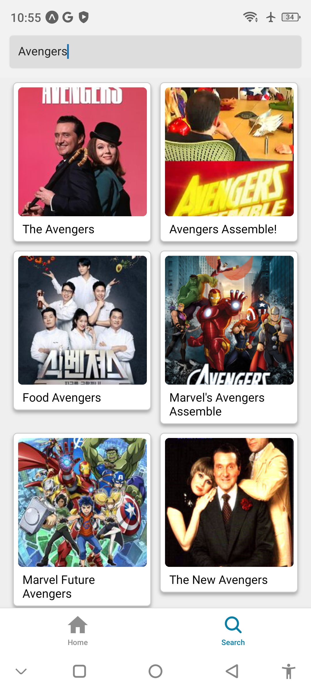
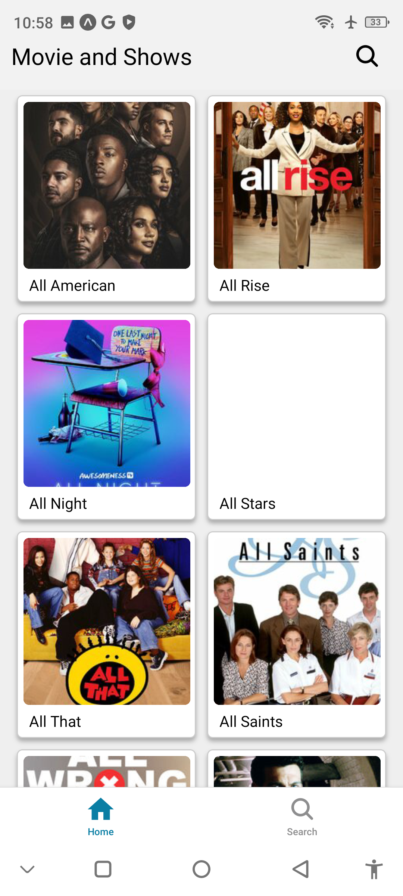
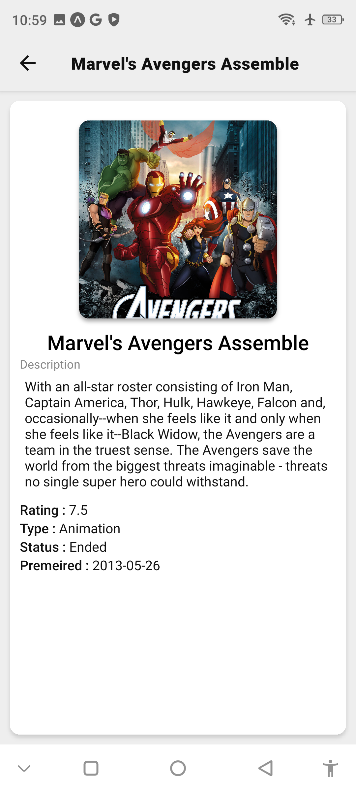

# React Native Movie App  

This is a React Native application designed to provide movie information through an intuitive and Netflix-inspired user interface. The app consists of four main screens:  

1. **Splash Screen**  
2. **Home Screen**  
3. **Search Screen**  
4. **Details Screen**  

## Features  

- **Splash Screen**:  
  Displays an engaging splash screen with a themed image to welcome users.  

- **Home Screen**:  
  - Fetches and displays a list of movies from the [TVMaze API](https://api.tvmaze.com/search/shows?q=all).  
  - Shows movie thumbnails, titles, and summaries in a clean and attractive layout.  
  - Includes a search bar at the top, which navigates to the Search Screen upon interaction.  
  - Clicking on a movie redirects the user to the Details Screen.  

- **Search Screen**:  
  - Contains a search bar to query movies using the [TVMaze API](https://api.tvmaze.com/search/shows?q=${search_term}).  
  - Displays search results similar to the Home Screen.  

- **Details Screen**:  
  - Shows detailed information about a selected movie, including:  
    - Title  
    - Summary  
    - Image  
    - Additional metadata from the API response  

- **Navigation**:  
  - Implements a bottom navigation bar for seamless switching between the Home Screen and Search Screen.  

- **User Interface**:  
  - A Netflix-inspired UI for an engaging user experience.  

## Getting Started  

### Prerequisites  

- Node.js installed on your machine  
- Expo CLI (`npm install -g expo-cli`)  

### Installation  

1. Clone this repository:  
   ```bash
   git clone https://github.com/Abhay2133/movie_app
   cd movie_app
   ```  

2. Install dependencies:  
   ```bash
   npm install
   ```  

3. Start the development server:  
   ```bash
   npm start
   ```  

4. Scan the QR code with the Expo Go app on your mobile device to run the app.  

## API Endpoints  

- Fetch all movies:  
  ```plaintext
  https://api.tvmaze.com/search/shows?q=all
  ```  

- Search for movies:  
  ```plaintext
  https://api.tvmaze.com/search/shows?q=${search_term}
  ```  

## Submission  

Once the project is complete, submit it using the form linked below:  
[Project Submission Form](https://docs.google.com/forms/d/e/1FAIpQLSeQ-9PffLbFkzTFfNNv6SqmlyKhV8OT5TJVkPiHBOq9G1-YTQ/viewform)  

## Technologies Used  

- React Native  
- Expo  
- [TVMaze API](https://www.tvmaze.com/api)  

## Screenshots  







## License  

This project is licensed under the MIT License. See the LICENSE file for details.  
```  

You can replace `<repository-url>` with the actual URL of your repository and include relevant screenshots to enhance the documentation.